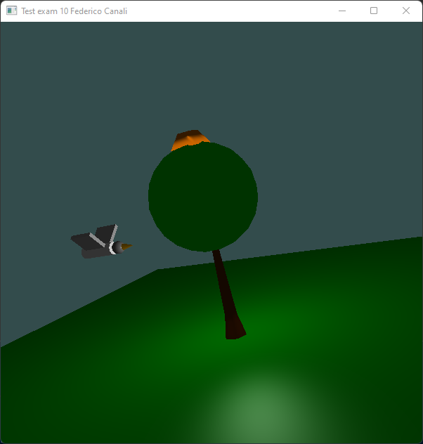

# Bird🕊️ and tree🌳 opengl

  

## What's it about?

Opengl application where a bird flies around a tree. 
  
The bird's wings fly with an oscillating motion between -π/4 and +π/4. 
To rotate the perspective you can use the arrows or you can drag the scene with the mouse. 
By clicking the W key, the movement of the wings is blocked or reactivated. 
By clicking the S key you can stop or reactivate the rotation of the bird. 
Clicking the R key reverses the direction of rotation of the bird. 
By clicking the TAB key: 
- the first time the crown of the tree turns yellow;
- the second time the crown of the tree disappears.
 
The scene is illuminated with Phong shading.
